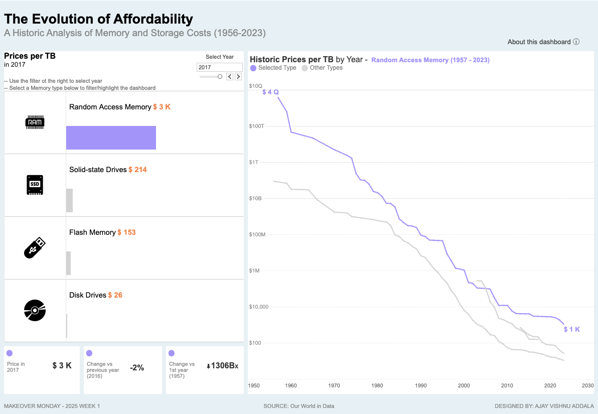

# Historical Price of Computer Memory and Storage  

This project visualizes the historical trends in the cost of computer memory and storage, expressed in US dollars per terabyte (TB) and adjusted for inflation. It highlights how technological advancements have made memory and storage increasingly affordable and accessible over time.  

  

## About the Project  
The dashboard explores the decline in costs for various types of memory and storage, including:  
- Random Access Memory (RAM)  
- Magnetic Storage (Disk)  
- Flash Memory  
- Solid-State Drives (SSDs)  

The data is sourced from [OurWorld in Data](https://ourworldindata.org/) with contributions by John C. McCallum (2023) and the U.S. Bureau of Labor Statistics (2024). Each year's data represents the cheapest historical price recorded up to that point.  

You can view the interactive Tableau dashboard on [Tableau Public](https://public.tableau.com/views/HistoricAnalysisofMemoryStoragecostsMOM2025W1/StorageCosts?:language=en-US&:sid=&:redirect=auth&:display_count=n&:origin=viz_share_link).  

## Repository Contents  
This repository includes:  
1. **Dataset**: The dataset used for analysis, formatted for ease of use.  
2. **Tableau File**: The .twbx file containing the dashboard.  
3. **Video Demo**: A video walkthrough of the dashboard features.  
4. **Snapshot**: A static image of the completed dashboard.  
 

